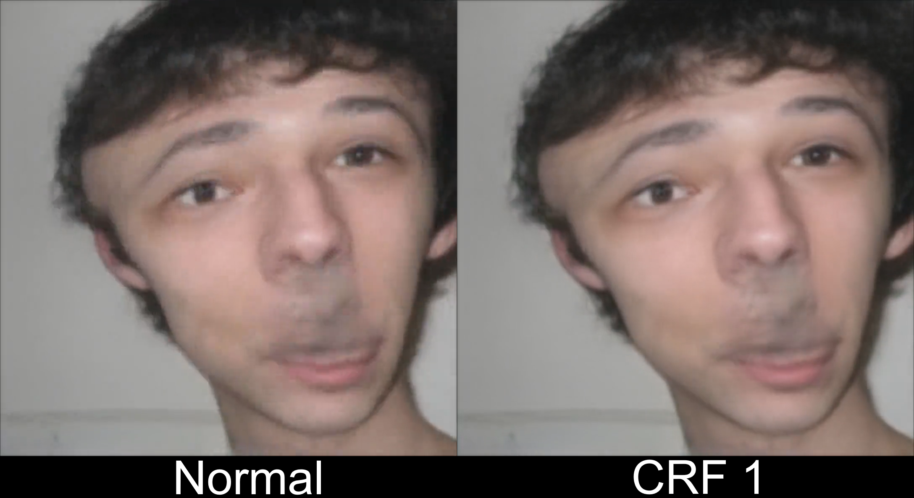

# Yanderify bit rate fix
Based on [dunnousername's Yanderify](https://github.com/dunnousername/yanderifier), Yanderify bit rate fix features small changes and improvements:

- Re-encoding will be done in either CRF 0 (lossless) or 1 (least compression, for compatibility), **depending on the executable that you're using**, for a better output quality. Original Yanderify was only using a low constant bit rate of 1200K when re-encoding the deepfakes.
- Support for 27 new image input formats have been added: `bmp, dds, dib, emf, exif, gif, ico, j2c, j2k, jfif, jp2, jpc, jpe, jpf, jps, jpx, pam, pbm, pcx, pfm, pgm, pnm, ppm, pxr, rle, tif, tiff`.
- Support for 1 new video input format has been added: `mpg`.
  - It's recommended to use mp4 files as input however, to ensure the entire driving video will be used in the output.
- Yanderify won't include any metadata into the outputs anymore.
- GUI has been changed a little bit, to make things more clear.
- An icon has been added for the application. It should fit to the name, I hope :slightly_smiling_face:
- `ffmpeg.exe` has been updated.

## Comparison

Left side of the image is created with the original Yanderify with the low bit rate. There is more noise noticeable, compared to the right side.

*Ignore that the face looks very weird, I took that frame intentionally so that more bit rate will be used...*

## "SSL CERTIFICATE_VERIFY_FAILED"
If you receive this error from the executable, just launch `SSL Certificate fix.bat` as admin. This error happens because Yanderify is trying to download a file for one module without success and this bat file just moves that file from one directory to the proper location in order to make Yanderify work.

## Building
Building was rather tricky. **PyInstaller 4.1** on **Python 3.7.2** has been used for building. I've made a bat file for installing the requirements and one for compiling Yanderify. Remember to edit Yanderify.spec and change the "pathex" location. Compiling has to be done in the Yanderify folder with all the files. After compiling I replaced the executable from the dist folder into the Yanderify folder because the content inside the dist folder included a lot of duplicated dll files and made the project more than twice as big as before.

*Surely not the "correct" way of doing this, but it worked for me as a newbie.*

## When uploading to YouTube
It's recommended to use a minimum resolution of **1080x1080** for the output to avoid YouTube's processing messing the bit rate up too much, because videos with a low resolution get processed with a low bit rate as well unfortunately. This can be achieved easily if the image input is in 1080x1080.

## Official Yanderify Discord Server
[**Here**](https://discord.gg/KmFJNJYaA3).
